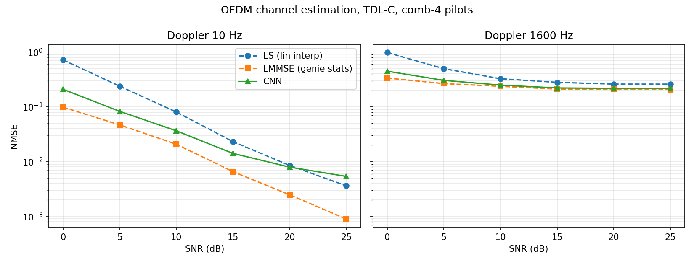

# neural-channel-estimator

**A 85k-parameter residual CNN that beats classical OFDM channel estimation
where it hurts — high-Doppler fading — packaged for deployment as a
standalone C++ TensorRT engine inside a 5G slot-time budget.**

Built as an NVIDIA Aerial L1 / inference-dApp style component: Python/PyTorch →
ONNX → C++ TensorRT with explicit host/device memory management, INT8
calibration, and Nsight-profiled per-stage latency.

## Problem

5G μ=1 (30 kHz SCS) channel estimation from sparse comb pilots (3.6% overhead,
symbols 2/11). At 1600 Hz Doppler (~494 km/h @ 3.5 GHz) the channel
decorrelates *within one slot* — linear/statistical interpolation from two
pilot symbols can't track it.

## Approach

Sionna 2.x TDL-C datasets → LS + genie-LMMSE baselines (installed Sionna API,
analytic covariances) → residual CNN refining the LS grid (`out = x + f(x)`) →
ONNX (opset 17, FP32 parity 1.79e-06) → TensorRT FP16/INT8 engines + Nsight
latency breakdown.

## Results — accuracy (measured, local)

Mean NMSE over 0–25 dB SNR at 1600 Hz Doppler (200 samples/cell, fresh seed):

| estimator | NMSE | vs LS |
|---|---|---|
| LS (linear interp) | 0.4348 | — |
| LMMSE (genie statistics) | 0.2449 | −2.49 dB |
| **CNN (85k params)** | **0.2769** | **−1.96 dB** |

The CNN gets within ~5% of genie LMMSE at ≥10 dB — without being told the
Doppler or noise statistics. Per-precision (FP32/FP16/INT8) and per-Doppler
INT8 breakdown: `results/accuracy_vs_quant.md`.

## Results — latency

**PLACEHOLDER: awaiting remote GPU run** (`results/latency_breakdown.md`).
Target framing: estimator e2e = X µs = Y% of one 35.7 µs OFDM symbol
(`profiling/budget.py`). The C++ engine, INT8 calibrator, and profiling
scripts are complete and build-ready (`inference/README.md`).

## Repo map

| path | what |
|---|---|
| `data/generate.py` | Sionna TDL-C dataset generator (comb-4 pilots) |
| `estimator/` | baselines, residual CNN, training, evaluation, ONNX export |
| `inference/` | C++ TensorRT engine (FP16/INT8), pinned-memory benchmark |
| `profiling/` | nsys scripts, latency report, slot-budget calculator |
| `docs/` | codebase-knowledge tutorial (start at `docs/index.md`) |

Reproduce: `make data` → `make train` → `make export`; GPU steps:
`inference/README.md`.
