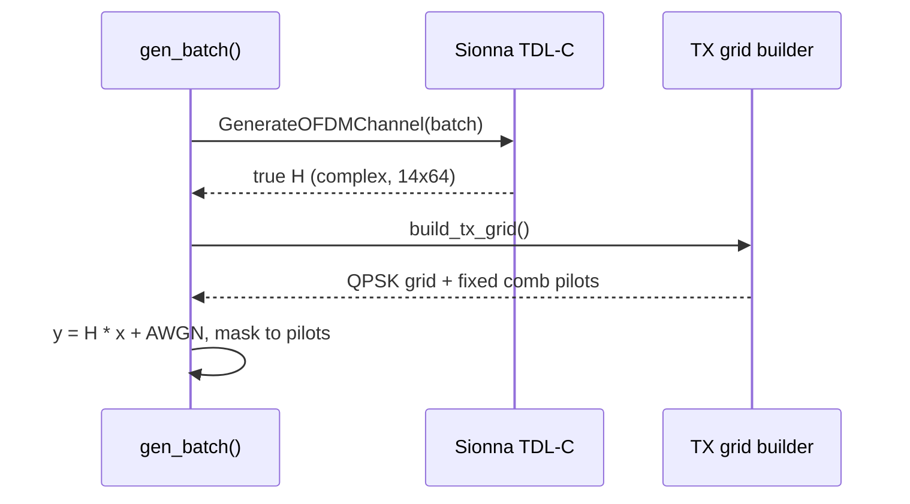

# Chapter 2: Dataset generator

`data/generate.py` turns the [config files](01_ofdm_numerology_and_configs.md)
into training pairs: *what the receiver saw at the pilots* → *what the channel
truly was everywhere*.

## Central use case

```bash
python data/generate.py --n 1000          # -> data/dataset/*.npy
```

Four arrays land on disk (full schema in `data/README.md`):

| array | shape | meaning |
|---|---|---|
| `rx_pilots` | (N, 2, 14, 64) | received grid, zeroed except pilot REs |
| `true_H` | (N, 2, 14, 64) | ground-truth channel per resource element |
| `doppler_hz`, `snr_db` | (N,) | per-sample labels for stratified splits |

The `2` axis is the **complex-as-2-channels** convention (ch0 = real,
ch1 = imag) — chosen because ONNX/TensorRT complex support is thin.

## How it works



Sionna's `TDL` model supplies the *physics* (correlated Doppler fading, delay
taps); the receive equation `y = H·x + n` is applied explicitly in the
frequency domain so pilot placement stays config-driven.

Two details future chapters depend on:

1. **`PILOT_SEED = 42`** — pilot QPSK values are identical in every sample, so
   [baselines](03_baseline_estimators.md) can reproduce them bit-exact.
2. **`gen_batch(n, f_d, snr, ...)`** is importable — `evaluate.py` uses it to
   make fresh fixed-SNR test cells that training never saw.

Sanity check baked into Prompt 1: channel correlation across the slot measured
1.000 at 10 Hz vs 0.616 at 1600 Hz — fast fading is really in the data.

Next: [Chapter 3 — Baseline estimators](03_baseline_estimators.md)
