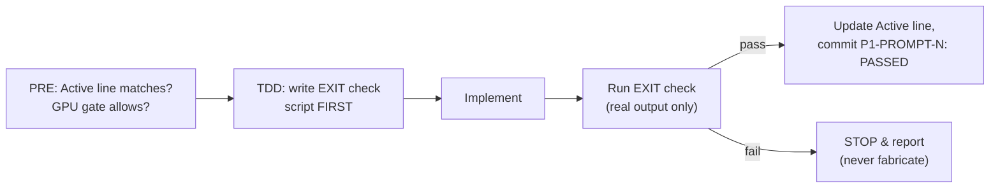

# Chapter 5: Harness, EXIT checks & GPU gates

This repo is built *by agent prompts* with verifiable gates — the meta-layer
that keeps the work honest and resumable across sessions.

## The Active line — one line of state

`CLAUDE.md` carries exactly one mutable line:

```
Active: P1-PROMPT-2 | PASSED 2026-06-10 → P1-PROMPT-3 | NOT STARTED
```

Any new session reads it (a SessionStart hook echoes it) and knows precisely
where the project stands. Nothing else in the repo is session-state.

## /run-prompt N — the only way work advances

Each numbered spec prompt runs through the same pipeline:



EXIT checks live in `scripts/check_exit_p*.py` — independent scripts that
re-derive expectations from config and refuse vibes. Example: Prompt 2's
check failed the first model honestly (+0.95 dB worse than LS) and forced the
[residual redesign](04_residual_cnn.md).

## GPU gates — macOS can't run CUDA

This machine is arm64 macOS with no CUDA. The gate table in `CLAUDE.md` marks
Prompts 4–5 as `GPU_STEP`: source files get written, compilation/profiling
parks as `GPU_STEP: ready for remote build`. A `PreToolUse` hook in
`.claude/settings.json` hard-blocks `nvcc/nsys/trtexec/cmake` locally
(exit 2) so the gate can't be forgotten. Training runs follow the same
spirit: full runs prefer a remote GPU; local MPS is for smoke tests
(policy added 2026-06-10).

> Numbers for gated steps are **never** invented — placeholders say
> `PLACEHOLDER: awaiting remote GPU run` until a real machine produces them.

Back to [index](index.md)
