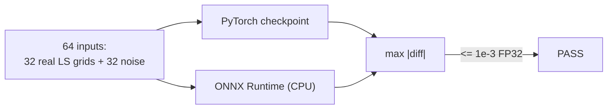

# Chapter 6: ONNX export & parity

Prompt 3 moves the [residual CNN](04_residual_cnn.md) out of PyTorch-land:
`estimator/export_onnx.py` freezes it into `model.onnx`, and
`scripts/verify_parity.py` proves the frozen copy still computes the same
function. Think notarizing a document before mailing it — the C++ TensorRT
stage (Prompt 4) must trust this file without PyTorch around to check.

## The export (estimator/export_onnx.py)

```python
torch.onnx.export(model, dummy, out, opset_version=17,
                  input_names=["ls_grid"], output_names=["h_refined"],
                  dynamo=False)
```

Three deliberate choices:

- **Opset pinned at 17** — TensorRT parsers care; "latest" is not a version.
- **Static shape (1, 2, 14, 64)** — deployment is per-slot inference
  (one execution per 0.5 ms slot); static shapes let TensorRT optimize hardest.
- Export-time asserts re-check the graph shape via `onnx.checker` — the
  script fails loudly rather than shipping a malformed graph.

## The parity gate (scripts/verify_parity.py)



Measured: **max abs diff 1.79e-06** — ~500× inside the 1e-3 budget. Inputs mix
real LS-grid statistics with pure noise so parity isn't an artifact of one
data distribution.

> **Tolerance discipline:** atol=1e-3 applies to FP32 *only*. FP16 (1e-2) and
> INT8 get wider budgets in Prompts 4–5 — conflating them hides real
> quantization damage.

Next stop is C++: [Chapter 5 — harness & GPU gates](05_harness_and_gpu_gates.md)
explains why Prompt 4 parks as `GPU_STEP` on this machine.

Back to [index](index.md)
