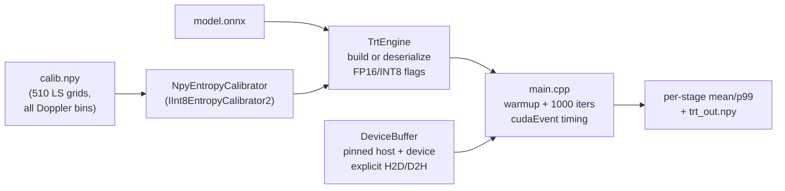

# Chapter 7: TensorRT C++ engine & profiling (written, awaiting GPU)

Prompts 4–5 produce the deployment artifact: a standalone C++ binary that
runs the [ONNX model](06_onnx_export_and_parity.md) through TensorRT. Every
source file exists and is review-complete; **nothing here has been compiled**
— this machine has no CUDA (see [Chapter 5](05_harness_and_gpu_gates.md)).

## The pieces (inference/src/)

Design points worth reading the source for:

- **`DeviceBuffer`** (buffers.h): pinned host memory via `cudaHostAlloc` —
  pageable memory would silently serialize `cudaMemcpyAsync` and corrupt the
  H2D/D2H timing story.
- **Per-stage timing** (main.cpp): `cudaEvent`s bracket H2D → `enqueueV3` →
  D2H separately, so the report says *where* microseconds go, not just a total.
- **Calibration set** (scripts/make_calib_npy.py): 85 grids from *each*
  Doppler bin — INT8 scales calibrated only on slow fading would clip fast
  fading exactly where accuracy matters most.
- **Engine caching**: first run builds + serializes; later runs deserialize —
  the benchmark never times the build.

## Profiling chain (Prompt 5)

`profiling/run_nsight.sh` (nsys trace) → `latency_report.py` (CSV →
`results/latency_breakdown.md`) → `budget.py` (e2e as % of the 35.7 µs
symbol / 0.5 ms slot — runs locally, already smoke-tested: 12 µs would be
33.6% of a symbol).

> Every number-bearing file currently says `PLACEHOLDER: awaiting remote GPU
> run` — by design. The remote session fills them; nothing is invented.

Back to [index](index.md)
