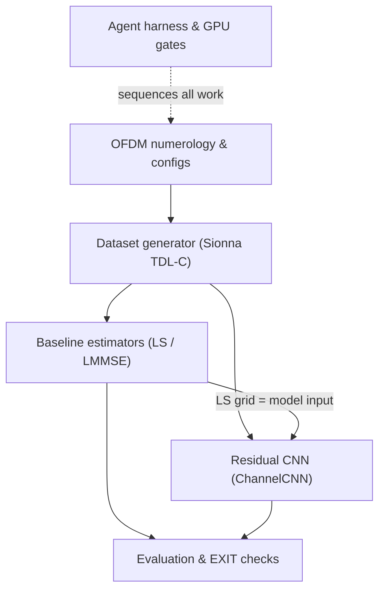

# Tutorial: neural-channel-estimator

A neural OFDM **channel estimator**: a small CNN learns to reconstruct the full
radio-channel grid from a few **pilot** measurements, beating the classical
LS/LMMSE estimators exactly where they struggle — fast-moving (high-Doppler)
channels — and (in later prompts) gets deployed as a C++ TensorRT engine under
a 5G slot-time budget.

**Source spec:** `../portfolio-projects.md` (Project 1) · **State:** see `Active:` line in `CLAUDE.md`

## Core abstractions

## Chapters

1. [OFDM numerology & configs](01_ofdm_numerology_and_configs.md)
2. [Dataset generator](02_dataset_generator.md)
3. [Baseline estimators: LS & LMMSE](03_baseline_estimators.md)
4. [Residual CNN](04_residual_cnn.md)
5. [Harness, EXIT checks & GPU gates](05_harness_and_gpu_gates.md)
6. [ONNX export & parity](06_onnx_export_and_parity.md)
7. [TensorRT C++ engine & profiling](07_tensorrt_engine.md)
8. [NVIDIA Aerial pyAerial mapping & slot-budget framing](08_aerial_mapping.md)

Chapters 1–7 cover all written code (Prompts 1–3 PASSED; 4–5 written and
parked as GPU_STEP — numbers await the remote GPU session).
Chapter 8 maps the estimator to pyAerial's pluggable channel-est slot and
frames the 5G-NR slot-time budget (latency numbers PARKED pending GPU run).

---
*Maintained in the style of [PocketFlow-Tutorial-Codebase-Knowledge](https://github.com/The-Pocket/PocketFlow-Tutorial-Codebase-Knowledge); updated at each prompt EXIT.*
